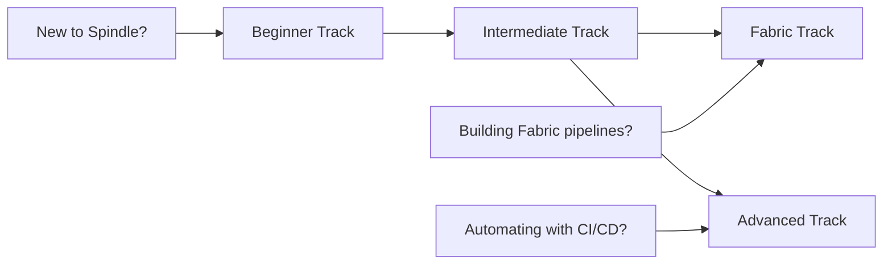

# Tutorials

Step-by-step learning paths for Spindle. Each tutorial explains concepts, walks through code, and links to runnable notebooks and example scripts.

## Choose Your Track

## Beginner Track

Zero to generating data. No prior Spindle experience required.

| # | Tutorial | What you'll learn | Time |
|---|---------|-------------------|------|
| 01 | [Hello Spindle](beginner/01-hello-spindle.md) | Install, generate your first dataset, verify FK integrity | 10 min |
| 02 | [Explore All Domains](beginner/02-explore-domains.md) | Survey all 13 domains, compare schemas and table counts | 15 min |
| 03 | [Custom Schemas](beginner/03-custom-schemas.md) | Build a .spindle.json schema from scratch | 20 min |
| 04 | [Output Formats](beginner/04-output-formats.md) | Export to CSV, Parquet, SQL INSERT, Excel, CDM | 15 min |

**Prerequisites:** Python 3.10+, basic pandas familiarity

## Intermediate Track

Real-world data engineering patterns. Requires completing the Beginner track (or equivalent experience).

| # | Tutorial | What you'll learn | Time |
|---|---------|-------------------|------|
| 05 | [Star Schema](intermediate/05-star-schema.md) | Transform 3NF to dimensional model with surrogate keys | 20 min |
| 06 | [Streaming](intermediate/06-streaming.md) | Emit events with rate limiting, anomalies, and burst windows | 20 min |
| 07 | [Chaos Engineering](intermediate/07-chaos-engineering.md) | Inject realistic data quality issues to test pipeline resilience | 20 min |
| 08 | [Validation Gates](intermediate/08-validation-gates.md) | Run quality checks and quarantine bad records | 15 min |
| 09 | [Composite Domains](intermediate/09-composite-domains.md) | Generate multi-domain datasets with cross-domain FK relationships | 20 min |

**Prerequisites:** Beginner track, familiarity with data pipelines

## Fabric Track

Microsoft Fabric workflows. Write to Lakehouse, Warehouse, SQL Database, and Eventstream.

| # | Tutorial | What you'll learn | Time |
|---|---------|-------------------|------|
| 10 | [Fabric Lakehouse](fabric/10-fabric-lakehouse.md) | Write Delta tables to Lakehouse, query with Spark SQL | 20 min |
| 11 | [Fabric Warehouse](fabric/11-fabric-warehouse.md) | Generate DDL and load a Fabric Data Warehouse | 15 min |
| 12 | [Fabric Streaming](fabric/12-fabric-streaming.md) | Stream events to Fabric Eventstream with anomaly injection | 20 min |
| 13 | [Medallion Architecture](fabric/13-medallion.md) | Build a Bronze/Silver/Gold pipeline with chaos and validation | 25 min |

**Prerequisites:** Intermediate track, Fabric workspace with a Lakehouse

## Advanced Track

Automation, declarative pipelines, and Day 2 operations.

| # | Tutorial | What you'll learn | Time |
|---|---------|-------------------|------|
| 14 | [Scenario Packs](advanced/14-scenario-packs.md) | Run pre-built YAML scenario packs for end-to-end workflows | 20 min |
| 15 | [GSL Specs](advanced/15-gsl-specs.md) | Write declarative YAML specs that orchestrate generation, chaos, and validation | 15 min |
| 16 | [Day 2 Operations](advanced/16-day2-operations.md) | Incremental generation, time-travel snapshots, PII masking | 25 min |
| 17 | [CI Integration](advanced/17-ci-integration.md) | Automate data generation in CI/CD pipelines | 15 min |

**Prerequisites:** Intermediate track, CI/CD experience (for tutorial 17)

---

## How Tutorials, Guides, and Examples Relate

| Content type | Purpose | Where |
|-------------|---------|-------|
| **Tutorials** (you're here) | Learn concepts step by step | `docs/tutorials/` |
| **Guides** | Reference for a specific feature | `docs/guides/` |
| **Example scripts** | Runnable Python code | `examples/scenarios/` |
| **Notebooks** | Interactive Jupyter notebooks | `examples/notebooks/` |

Tutorials reference guides for deep dives and link to notebooks/scripts for hands-on practice.
